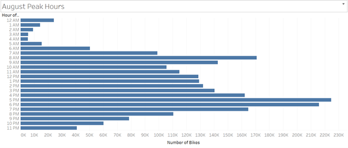
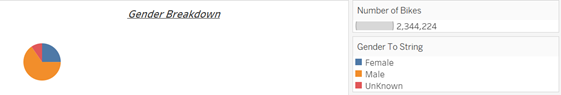
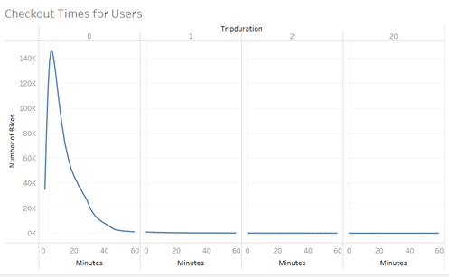
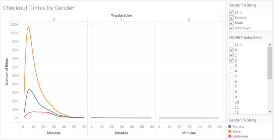
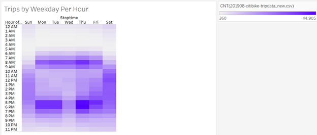
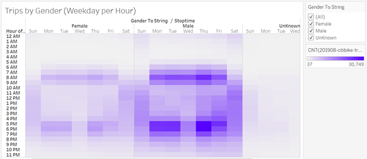
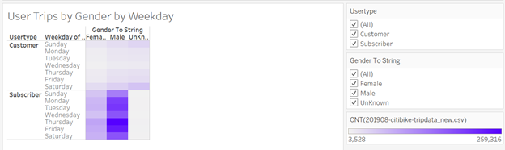

# CitiBike_With_Tableau

[link to dashboard](https://public.tableau.com/app/profile/samir.rifi/viz/CitiBike_16278541596580/NYCCitibikeanalysis?publish=yes)

## PURPOSE OF THE ANALYSIS:

The purpose of this analysis is to create new visualizations on bike trip data to be used for the final presentation and analysis to pitch to investors, to convince them that a bike-sharing program in Des Moines is a solid business proposal.

## RESULTS:
### 1. August Peak Hours
#### 1.1. Data Visualization:

#### 1.2. Analysis:
o	The highest usage is recorded between 5 to 6 pm with the highest number of rides being registered at 5pm. The following busiest hour is 8 am.

### 2. Gender Breakdown
#### 2.1. Data Visualization:

#### 2.2. Analysis:
o	65% of bike users are males while females account only for 25%. The rest is Unknown.

### 3. Checkout Times for users
#### 3.1. Data Visualization:

#### 3.2. Analysis:
o	Most rides are around 5 minutes length and there is a significant drop as we are getting close to 20 minutes, with almost all ending before an hour.

### 4. Checkout Times by Gender
#### 4.1. Data Visualization:

#### 4.2. Analysis:
o	Same trend on ride duration, as for the overall, noticed for all genders.

### 5. Trips by Weekday per Hour
#### 5.1. Data Visualization:

#### 5.2. Analysis:
o	For all weekdays except for Wednesday, 5 to 6pm is where most of the usage is recorded, with a remarkable spike on Thursday and a significant drop on Wednesday on the same time slot.
o	The next busiest time slot is 8am for all weekdays with no exception, with a significant bump on Thursday
o	The usage is heavier on weekdays than on the weekend.

### 6. Trips by Gender (Weekday per Hour)
#### 6.1. Data Visualization:

#### 6.2. Analysis:
o	Same trend as the one noticed on the overall data is applicable by gender, with highest density for males since they are the heaviest users.

### 7. Users Trips by Gender by Weekday 
#### 7.1. Data Visualization:

#### 7.2. Analysis:
o	The usage increases significantly on the 2 last days of the week for both males and females with a significant drop on Wednesday.
o	Subscribers will be using bike sharing services more during weekdays than on weekends while it is the opposite for the other customers.

## SUMMARY:

o	From the analysis above we can come to the conclusion that most bike sharing service users are subscribers that use bikes during weekdays and for short rides (less than 10 minutes with peak happening at 5 minutes).
	This high usage frequency coupled with short usage time will result on high service level, since there will always be a high number of bikes available for users at all times and will certainly maximize the profit since this will retain subscribers and attract occasional users.

o	To give further depth to the analysis, we can couple demographics with geographic data to know for example the average age of users travelling a given circuit and using specific stations.
o	We can also add “places of interest” as an additional station attribute to predict the users’ profile in a given area. For example, if a station is close to a campus, the odds that users 18-24 years old would be heavy users while for stations that are close to offices, users will be more looking toward 25-40 years old.
	This information will help customize subscription plans according to each group’s needs and income.

